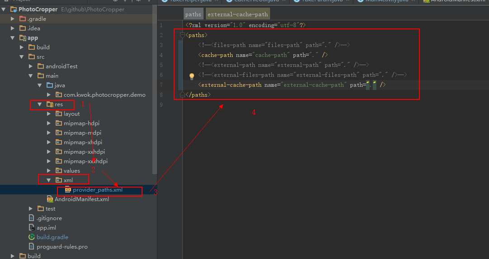

# [Android] 获取照片（相机，相册）
## 简述
作为一个android小码农，每次开发一个APP，都需要根据需求在网上找一些轮子，免得自己重复制作，毕竟android发展也算成熟了，网上的轮子一大推，哈哈哈...

不过虽然网上轮子多，但是如果每个APP都需要重新再网上找，就显得麻烦了。

比如说android的获取照片功能，

所以，自己就弄了个开源库，以后用到就可以直接使用了，哈哈哈~~~

当然，此开源库，主要还是参考了网上其他大神写的库来，自己封装的。

## 下载JAR
[takephoto.jar](outputs/)

## 功能
- 相机获取图片
- 相册获取图片
- 剪切
- 压缩
###### 注： 剪切功能和压缩功能是互斥的，因为经过剪切后，图片本来就已经很小了，无须再压缩

## 注意
**本库没有适配android 6.0 以上动态权限，所以如果需要使用此库前必须确保自己项目已经获取到以下三个权限**
```
<uses-permission android:name="android.permission.CAMERA"/>
<uses-permission android:name="android.permission.READ_EXTERNAL_STORAGE"/>
<uses-permission android:name="android.permission.WRITE_EXTERNAL_STORAGE"/>
```


**至于6.0动态权限的获取可以参考其他开源库，自己可以在github上查找，我就不列表出了，当然有时间，我还是会自己再封装android 6.0以上动态权限库的，敬请期待吧**


## 用法
1. 打开相机（）
```
public void onCamera(View view) {
    mTakeParam = new TakeParam(this);
    startActivityForResult(TakeHelper.buildCameraIntent(mTakeParam), mTakeParam.REQUEST_CODE_CAMERA);
}
```
2. 打开相机
```
public void onAlbum(View view) {
    mTakeParam = new TakeParam(this);
    startActivityForResult(TakeHelper.buildAlbumIntent(), mTakeParam.REQUEST_CODE_ALBUM);
}
```

3. 剪切设置(默认为 true)
```
 mTakeParam.isCrop = true;
```
4. 压缩设置(默认为 false)
```
 mTakeParam.isCompress = false;
```

5. 处理回调
```
@Override
protected void onActivityResult(int requestCode, int resultCode, Intent data) {
    super.onActivityResult(requestCode, resultCode, data);
    TakeHelper.handleResult(this, mTakeParam, requestCode, resultCode, data);
}
```

6. 实现ITakePhotoListener接口
```
public class MainActivity extends AppCompatActivity implements ITakePhotoListener {

    private TakeParam mTakeParam;

    .
    ..
    ...

    @Override
    public void onComplete(Uri uri) {
        //获取到图片Uri，显示在ImageView
        mImageView.setImageURI(uri);
    }

    @Override
    public void onCancel() {
        //取消选择
    }


    @Override
    public void onFailed() {
        //失败回调
        Toast.makeText(this, "获取图片失败", Toast.LENGTH_SHORT).show();
    }

    @Override
    public void startCropIntent(Intent intent) {
        //启动剪切功能
        startActivityForResult(intent, mParam.REQUEST_CODE_CROP);
    }
```

7. 最后，最好选择在使用完毕时，选择清理的缓存的照片，如下：

```
    @Override
    public void onComplete(Uri uri) {
        mImageView.setImageURI(uri);
        //TakeHelper.clearFile(this);
    }

    //或者

    @Override
    protected void onDestroy() {
        TakeHelper.clearFile(this);
        super.onDestroy();
    }
```


## 适配android 7.0
1. 方法1 -- 在Application类种添加以下代码
```
public class App extends Application  {

    @Override
    public void onCreate() {
        super.onCreate();
        if (Build.VERSION.SDK_INT >= Build.VERSION_CODES.N) {
            StrictMode.VmPolicy.Builder builder = new StrictMode.VmPolicy.Builder();
            StrictMode.setVmPolicy(builder.build());
        }
    }
}
```

2. 方法二 （相对麻烦）
-  2.1在AndroidManifest

```
    <provider
        android:name="android.support.v4.content.FileProvider"
        android:authorities="${applicationId}.fileprovider"
        android:exported="false"
        android:grantUriPermissions="true">
        <meta-data
            android:name="android.support.FILE_PROVIDER_PATHS"
            android:resource="@xml/provider_paths" />
    </provider>
```
- 2.2  在项目资源文件下创建xml 目录，并且在xml目录下创建一个文件，文件名需要和上一步resource属性的文件名相对应，如：**provider_paths**，如下图


在上图的五个标签(**files-path**、**cache-path**、**external-path**、**external-files-path**、**external-cache-path**)可以根据自己缓存文件路径选择开启哪几个

## 其他
库里面还有一些其他属性可以自定，详细情况可以查看
[TakeParam](takephoto/src/main/java/com/kwok/takephoto/TakeParam.java)


### 感谢：
[本库的设计模式主要是参考了已经停止维护的PhotoCropper](https://github.com/ryanhoo/PhotoCropper)